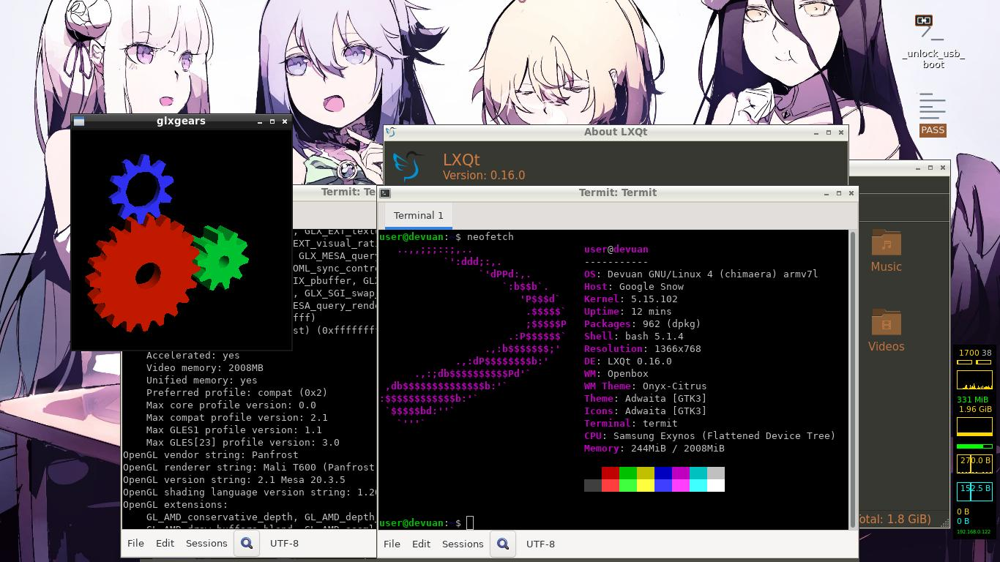

# Some builded disk images of [xe303c12_play_linux](https://github.com/quarkscript/xe303c12_play_linux)

## Devuan 4 / Chimaera (stable) disk image
[Link to release](https://github.com/quarkscript2/xe303c12_arm_linux/releases/tag/Devuan_Chimaera_Arm_for_Google_Snow_Chromebook)
- DE: LXQT + OPENBOX + SDDM autologin
- Disk size: 1882M
- Filesystem: btrfs
- Init: sysvinit
- External apps: thunderbird, neovim, patched mesa, custom kernel.

Licenses depends of used apps, mostly it some of [GNU GPL](https://www.gnu.org/licenses/)

> mesa-utils and neofetch are not installed by default

> Extra instructions could be found at source repo

## Gentoo (stage 3) disk image
[Link to release](https://github.com/quarkscript2/xe303c12_arm_linux/releases/tag/Gentoo_armv7hf_for_Google_Snow_Chromebook)

In case you want to play with Gentoo Linux on Google Snow Chromebook (XE303C12) this may be a solution for it. 
- DE: none, "stage3" console
- Disk size: 15028M
- Filesystem: btrfs
- Kernel: 5.15.102 (manually installed)
- Init: openrc
- System lib: glibc
- Login: root
- Password: q
> There is no point in compiling a new kernel during installation, unless you write your own recipe for it

> If you need hw-acceleration, the mesa sources should be downgraded to 20.3.x and [patch](https://github.com/quarkscript/linux-armv7-xe303c12-only/blob/master/archlinuxarm/some_forked_apps/mesa/gpuac.patch) applied
